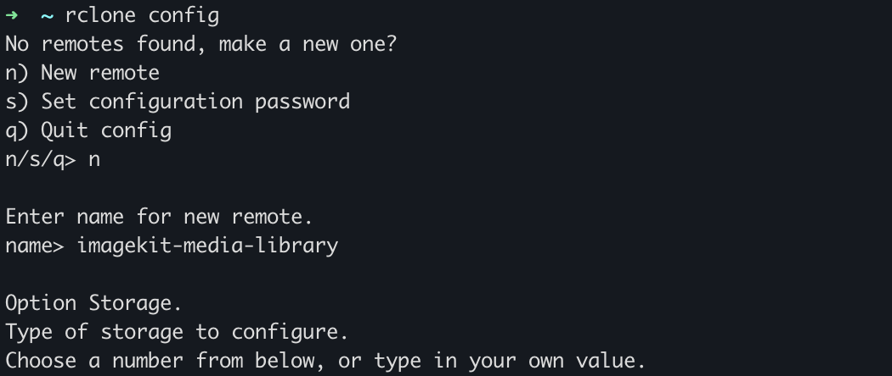
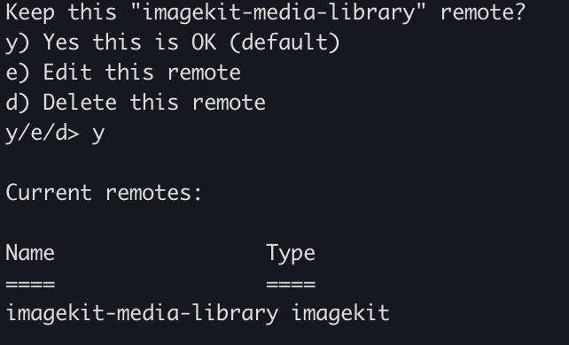

# Rclone


[Rclone](https://rclone.org/) is a command-line program that helps manage files on a cloud storage. It supports [over 70 cloud storage products](https://rclone.org/#providers) and has powerful cloud equivalents to the unix commands rsync, cp, mv, mount, ls, ncdu, tree, rm, and cat.

ImageKit natively integrates with rclone to offer a seamless experience in managing your media library assets via the command-line and opens up doors to many advanced workflows.

In this guide, we would be looking at how you can configure ImageKit's Media Library as a cloud storage provider to rclone.

## Getting Started

Before you start, make sure you have an ImageKit account.
[Sign up](https://imagekit.io/registration/) for a free plan, starting with generous usage limits and when your requirements grow, you can easily upgrade to a plan that best fits your needs. More pricing information is available [here](https://imagekit.io/plans).

Also, this guide assumes that you have rclone set up in your system. You can check out the [Rclone install guide](https://rclone.org/install/) to install it based on your operation system i.e. Linux / macOS / Windows.

## Configuring rclone

To configure ImageKit as a remote on rclone:

1. **Run rclone's interactive configuration command**

* Open your command line interface and run `rclone config`.
* Choose `n` for a new remote.
* Name your new remote (eg: `imagekit-media-library`)
* Select the number corresponding to `ImageKit.io` when prompted for storage type.<br />


2. **Enter your ImageKit credentials**

* Get your `urlEndpoint`, `publicKey` and `privateKey` from your [ImageKit dashboard](https://imagekit.io/dashboard/developer/api-keys).
* Input the obtained credentials when prompted.<br />


3. **Save and Exit**
* When prompted to edit advanced config, select `n` to continue with the default configuration.
* After you've completed the above steps, you should see a remote added as shown below.
* Finally, select `q` to exit the interactive config session.<br />


With that, you have successfully added your ImageKit's Media Library as a cloud storage provider to rclone. You can verify this using the `rclone listremotes` command.


## Common Commands

Now that you've set up ImageKit as a provider to rclone, you can try out the common commands to interact with your media library right from your command-line.

1. `ls` - List all the assets in the media library with size and path. (eg. `rclone ls imagekit-media-library:`)
2. `lsd` - List all directories the media library. (eg. `rclone lsd imagekit-media-library:`)
3. `mkdir` - Create a folder in the media library if it doesn't already exist. (eg. `rclone mkdir imagekit-media-library:test-folder`; this will create a folder with the name `test-folder` in the root of your library)
4. `copy` - Copy files from a source to a destination. The source / destination can either be a path in your media library or even your local system.
* **To copy a local file to your media library**: `rclone copy <path/to/local/file> imagekit-media-library:<path/where/file/to/be/copied>`. You can leave the destination path empty to copy to the root.
* **To copy a file from your media library to your local system**: `rclone copy imagekit-media-library:<path/to/remote/file> <local/path/where/file/to/be/copied>`
5. `move` - Same as `copy` but removes the file from the source after the operation. (eg. `rclone move <path/to/local/file> imagekit-media-library:<path/where/file/to/be/moved>`)
6. `sync` - A uni-directional sync which makes the source and destination equal, _modifying the destination only_. For example, to clone your media library to the local system, you could do something like `rclone sync imagekit-media-library: <path/to/local/directory/to/sync>`

To explore more commands, run `rclone help` in your terminal.

## Advanced Use Cases

### Migrating assets from local filesystem to ImageKit

Rclone makes it possible to sync and bring all your media assets from a local filesystem over to your ImageKit's media library.

#### Copy a single file

To sync a file from local filesystem to your media library, you can use the following syntax:
```
rclone copy <source-path> <destination-path>
```

Usage Example:
```
rclone copy <path/to/local/file> imagekit-media-library:<path/inside/media/library>
```

#### Sync all files

To sync a complete folder from local filesystem to a folder in your media library, you can use the following syntax:
```
rclone sync <source-path> <destination-path>
```

Usage Example:
```
rclone sync <path/to/local/folder> imagekit-media-library:<path/to/destination/folder>
```


The `sync` command modifies the destination completely to make it equal to the source. This means that it deletes ALL the pre-existing files in the destination which do not exist in the source.

For this reason, using this on the **root** of your media library could be a potentially destructive action as it could wipe out your entire library.

Therefore, it is recommended to create a new folder in your media library and sync your assets to that folder.


### Migrating assets from S3 to ImageKit

Rclone makes it possible to sync and bring all your media assets from an S3 bucket over to your ImageKit's media library.

To configure S3 as a cloud storage provider to rclone, follow the [setup instructions](https://rclone.org/s3/). Once completed, you should see an S3 remote in the rclone config in addition to the previously setup ImageKit remote.


Now, you can do all the operations like `copy`, `move` etc. across these remotes.

#### Copy a single file

To sync a file from S3 bucket to your media library, you can use the following syntax:
```
rclone copy <source-path> <destination-path>
```

Usage Example:
```
rclone copy s3-sandbox:<path/to/file> imagekit-media-library:<path/inside/media/library>
```

#### Sync all files

To sync a complete S3 bucket to a folder in your media library, you can use the following syntax:
```
rclone sync <source-path> <destination-path>
```

Usage Example:
```
rclone sync s3-sandbox:<path/to/bucket> imagekit-media-library:<path/to/destination/folder>
```


The `sync` command modifies the destination completely to make it equal to the source. This means that it deletes ALL the pre-existing files in the destination which do not exist in the source.

For this reason, using this on the **root** of your media library could be a potentially destructive action as it could wipe out your entire library.

Therefore, it is recommended to create a new folder in your media library and sync your assets to that folder.
