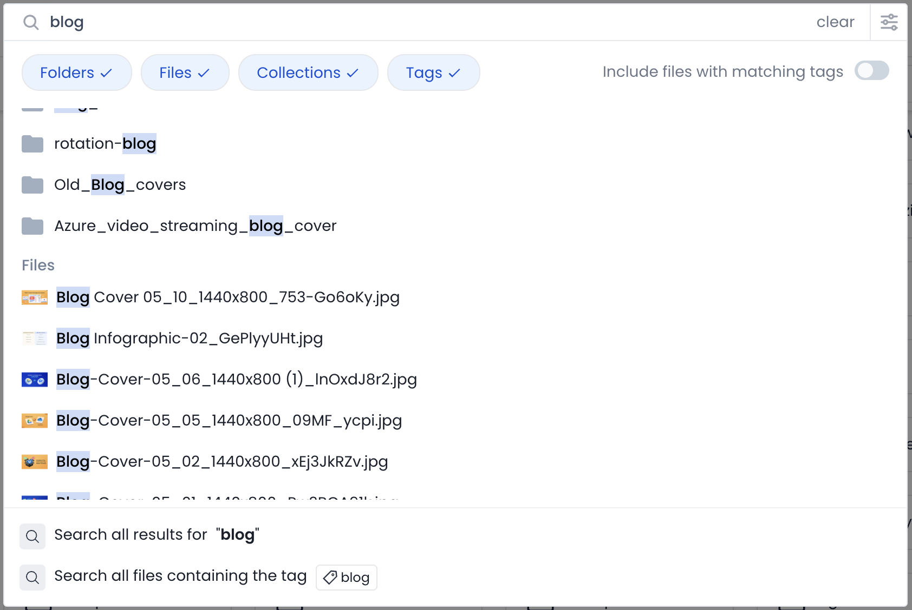
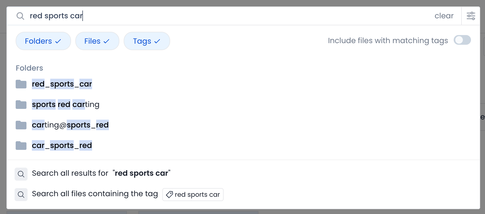
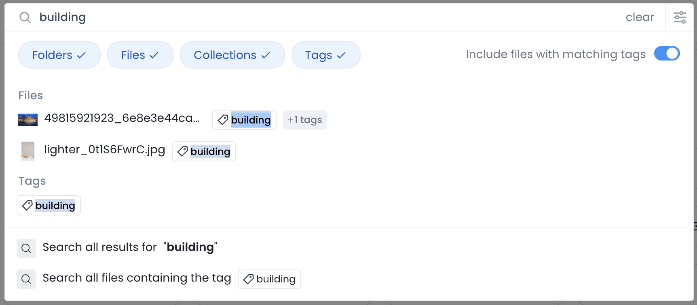

# Search, update & delete files

ImageKit.io provides the ability to search, delete, [tag](image-tags.md), and update files easily.


Using the advanced search in ImageKit


## File Search

You can access search functionality from the top of the Media Library section. There are two search modes available.

### Search autocomplete

Search autocomplete helps you find the right assets quickly even if you don't remember the exact name. As you type, the search bar will show suggestions based on the asset name, matching tags, and other metadata. You can click on any of the suggestions to navigate to that asset directly. Search results are also highlighted when possible to help you understand why a particular asset was suggested.

For example, search results showing files & folders that has `blog` in their name:

Here, the search query is `red sports car`, but the results also include assets with `sports` or `red` in their name. This allows you to find the right asset even if you don't remember the exact name:

Search results showing assets with one or more tags matching the search query, i.e., `building`:

The match is case insensitive and the search results are sorted based on the relevance of the search query.

You can further narrow search results by using quick filters `Folders`, `Files`, `Collections`, and `Tags`.

The toggle at the top, "Include files with matching tags," allows you to control whether the search results should include files with matching tags.

### Advanced searching

The advanced search mode can be accessed by clicking on the filter icon in the search bar. This mode allows you to create complex search queries to find the exact file(s) you are looking for. The advanced search mode allows searching based on -

* Name
* [Tags](image-tags.md)
* File size
* Dimensions (applicable for images)
* Format
* [Private images](../../features/security/private-images.md)
* Transparency (applicable for images)
* First upload date
* Last modified date

For example, let's say you want to find a file -

* That was uploaded within the last month.
* And has either the `banner` or the `summer-collection` tag set.
* And the dimension is larger than `1024x768`.

You can set these filters in the media library UI to get all files that match the above search criteria.

#### Grouping of multiple searches queries

You can also create more complex queries by combining multiple search parameters and changing how they are grouped.

There are two places where you can add a new search query -

1. Clicking on the `+` icon next to an existing filter lets you combine other search parameters in the same filter.
2. Clicking on `+ Add Filter` link lets you add another filter in parallel to the existing one. This new filter can be combined either to narrow (`and` operator) or to expand (`or` operator) the results from other search filters.

### Visual Search


**Enterprise plan only**

This feature is only available in custom enterprise pricing plans.


Visual search allows you to search for similar images based on visual content. Instead of relying on text-based keywords or metadata, you can search based on visual content like colors, shapes, textures and any other information that can be derived from the image itself.

Read more about Visual Search [here](../../features/visual-search.md).

## File Deletion

Right-click the file to open menu options. Select the "Delete" item. This will open a confirmation popup. Click on "Submit" to permanently delete your file. Upon confirmation, the file is deleted permanently from the Media Library.


Delete file


## Bulk File Delete

You can select multiple files together by pressing and holding the Command key in Mac or the Ctrl key in Windows. Right-click any file and click the "Delete" option to delete all files in one go.

## File Update

ImageKit.io currently supports adding and editing [tags](image-tags.md), updating custom coordinates, and applying [extensions](../../extensions/overview/README.md) from the media library.

To view file details, right-click the file and click the "Details" option.

This will open a detailed section that has all the file details, including file name, file size, and more. Here, you can add new or edit existing tags, apply extensions, etc.

By clicking on the 'Custom focus area' option in the dropdown menu, you can update the custom coordinates of the image.

## Using API

ImageKit.io also provides APIs to upload, delete, and search for image files within its media library. The documentation for the same can be found here:

1. [Upload API](../../api-reference/upload-file-api/).
2. [Search API](../../api-reference/media-api/list-and-search-files.md).
3. [Image Delete API](../../api-reference/media-api/delete-file.md).

If you have any questions regarding Uploading, Deleting, or Updating a file, please get in touch with our team at [support@imagekit.io](mailto:support@imagekit.io).
