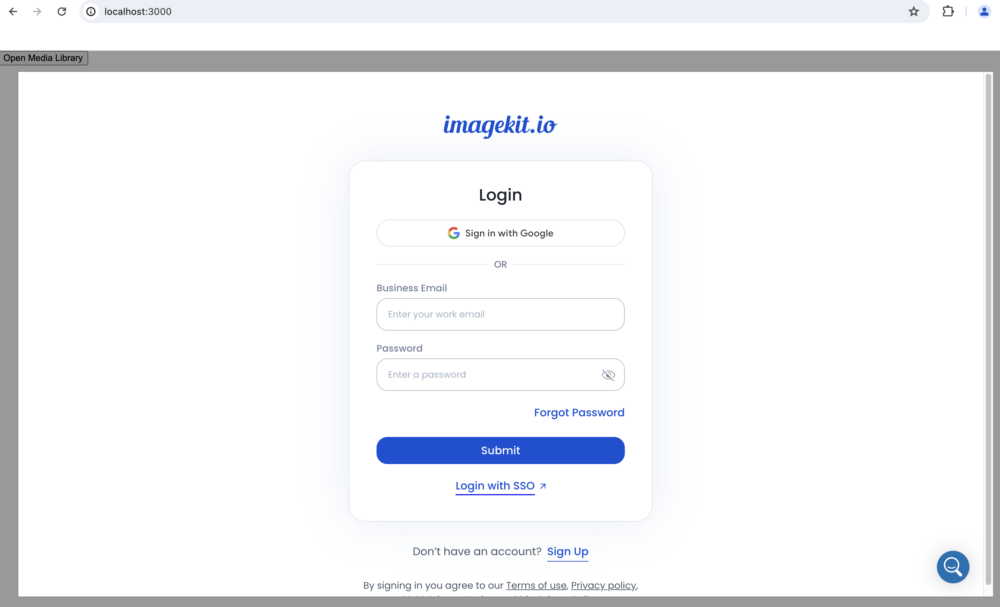
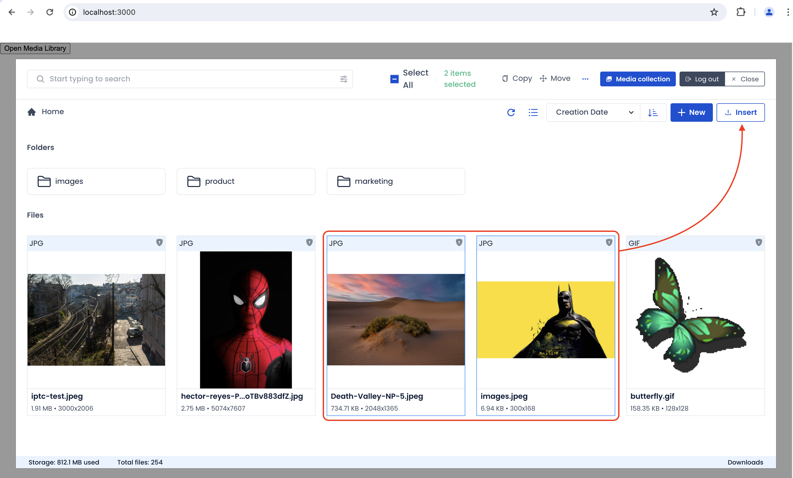
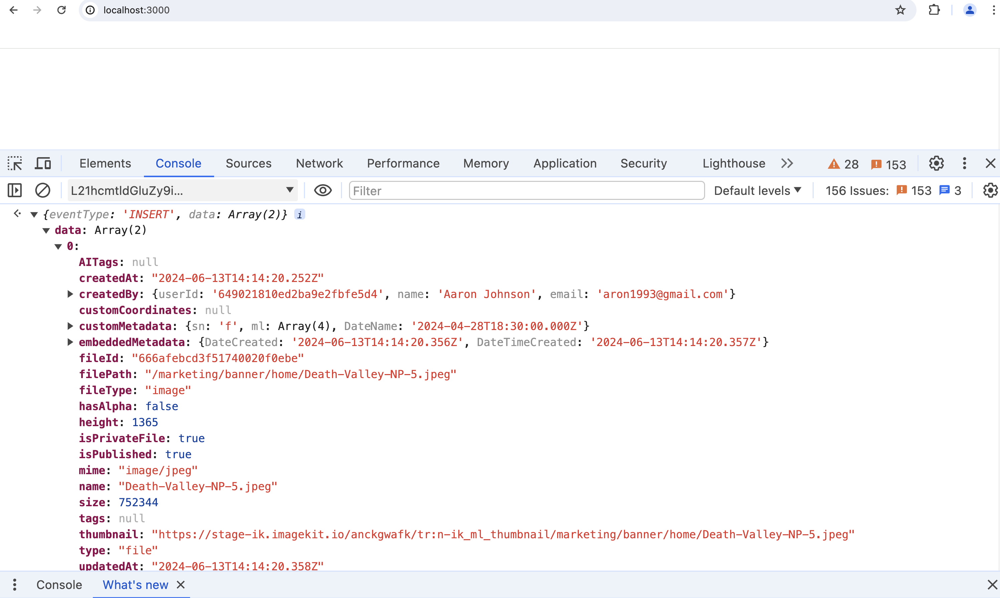

# Media library widget

The [media library widget](https://github.com/imagekit-developer/embeddable-media-library) provides a way to easily integrate [ImageKit Media Library](../../media-library/overview/) into your CMS or any other web application. Using this, you can access all the assets stored in your Media Library from your existing CMS or application.

Integrating the media library widget is straightforward as you will discover in this document.

We have some ready-made sample integrations with the following applications.

* **[**CKEditor integration**](ckeditor5-plugin.md)**

## Media library widget plugin features

The JavaScript-based plugin provides a way to seamlessly access your [ImageKit Media Library](../../media-library/overview/) within your own CMS or web application. You can search all assets stored in the media library and consume them in your application.

**The plugin allows you to:**

* Login to ImageKit from within your CMS.
* Search and insert images directly into your CMS from your ImageKit Media Library.
* Configure UI view options, such as inline or modal-based Media Library panel.
* Supply a custom container class so that you can customize the styling to match your application theme.


## **How to integrate the plugin in your app**

### Integration overview

Integrating the ImageKit Media Library plugin into a page in your web application or CMS interface is straightforward. We will go through the following steps in details one by one:

1. [**Include the plugin script and create a container element**](./#1-include-the-plugin-script)** -** Include the plugin script file in the web page to embed the Media Library. Create a container element where the widget will be rendered.

2. [**Initialize the media library widget**](https://app.gitbook.com/@imagekit-io/s/docs/\~/drafts/-MOeRVlxk26WIzUeOQ4D/sample-projects/embeddable-media-library#2-initialize-the-media-library-widget)** -** Provide the configuration options and callback to initialize the widget. These options include the mandatory container within which the Media Library Widget UI will be rendered and some other optional settings as described later in the page.

3. [**Instantiate the Media library widget and open it**](./#4-instantiate-the-embedded-media-library-and-open-it)** -** Using the configuration options and callback method, now the plugin can be instantiated through the `IKMediaLibraryWidget` constructor and used by navigating to the webpage where it has been embedded.

4. [**Insert images from the Media Library via the plugin**](./#5-embed-images-from-the-media-library-via-the-plugin)** -** Choose images and other files from within the media library interface and insert them in your CMS or web application.

### **1. Include the plugin script and create a container element**

Insert the following script on the web page where you want to access the Media Library plugin:

```markup
<script src="https://unpkg.com/imagekit-media-library-widget/dist/imagekit-media-library-widget.min.js"></script>
```


Internet Explorer does not have native support for all Media Library Widget features. We recommend accessing it on a supported browser, such as Google Chrome or Mozilla Firefox.


Create an HTML container element where the widget will be rendered:

```markup
<div id="container"></div>
```

### 2. Initialize the media library widget

Using the configuration options and callback function, let’s instantiate the plugin:

```javascript
const mediaLibraryWidget = new IKMediaLibraryWidget(config, callback);
```

#### Parameters

* **options -** Configuration options that are applied to the Media library widget instance. 
* **callback -** This function is called after the user clicks "Insert" button in the Media library. The callback receives a JSON payload of the selected images.


**Note:** Check that `renderOpenButton` option is set to `true` in the plugin configuration option for the view control to become available.


#### Plugin options

The plugin accepts the following configuration options, including the mandatory `container`. Apart from this, it also accepts some optional settings that control the plugin's behavior and styling.

| Option             | Datatype               | Description                                                                                                                                                      | Default value                                                                             |
| ------------------ | ---------------------- | ---------------------------------------------------------------------------------------------------------------------------------------------------------------- | ----------------------------------------------------------------------------------------- |
| `container`        | String, or DOM element | <p><strong>Required</strong><br><em><strong></strong></em>The name of the container within which the Media Library will be rendered. Supports CSS selectors.</p> | None                                                                                      |
| `className`        | String                 | Optional styling class to apply to the container element.                                                                                                        | None                                                                                      |
| `dimensions`       | Object                 | Dimensions of the Media Library `container` element.                                                                                                             | <p><code>{ height: '100%',</code></p><p><code>width: '100%' </code><br><code>}</code></p> |
| `view`             | String                 | Toggle Media Library interface mode: `modal` or `inline`                                                                                                         | `'modal'`                                                                                 |
| `renderOpenButton` | Boolean                | Toggle whether button to open Media Library UI is displayed. Set this to`false` if using a custom editor plugin or custom open trigger.                          | `true`                                                                                    |

**Configuration options sample:**

```javascript
const config = {
  container: '#container',   // the element in which the widget will be rendered
  className: 'media-library-widget',
  dimensions: {
    height: '100%',
    width: '100%',
  },
  view: 'modal',  // modal (default) | inline
  renderOpenButton: true  // false | true (default)
};
```

#### Callback function and payload

This callback function is called after the user clicks "Insert" button in the Media library. The callback receives a JSON payload of the selected images. It is up to you how you consume this data in your application.

```javascript
function callback (payload) {
  // this is the callback handler
  // … consume json payload …
}
```

#### Sample payload data:

The following shows an example of the JSON payload returned after selecting and inserting an image from the Media Library Widget UI.

```javascript
{
  eventType: 'INSERT',
  data: [{
    createdAt: "2020-12-15T08:33:04.570Z",
    customCoordinates: null,
    fileId: "5fd874c040308546019f0500",
    filePath: "/rally_s_tK613HYyf.jpg",
    fileType: "image",
    isPrivateFile: false,
    name: "rally_s_tK613HYyf.jpg",
    tags: null,
    thumbnail: "https://ik.imagekit.io/o00s3beva/tr:n-media_library_thumbnail/rally_s_tK613HYyf.jpg",
    type: "file",
    url: "https://ik.imagekit.io/o00s3beva/rally_s_tK613HYyf.jpg"
  }]
}
```

### 3. Run the application

Navigate to your application webpage in the browser. You should see the following button:


Upon clicking it, if you are already logged in to ImageKit on this browser, the Media Library view should open up directly. Otherwise, the login screen will be displayed.



Login to ImageKit with your email and password.

Upon logging in successfully, you should automatically be routed to the Media Library view.


### 4. Insert images from the Media Library via the plugin

The Media Library Widget looks and works similar to the ImageKit dashboard. An additional feature is the ability to insert selected images or files from the plugin.

In the upper right area of the screen, an "Insert" button should be present. Click on this to trigger the image selection handling callback on your web app page.



The modal view should close automatically. Open the browser console and verify that the image payload data has been logged successfully:



## Sample application




```markup
<!DOCTYPE html>
<html>

<head>
  <title>ImageKit Media Library Widget</title>
  <meta name="viewport" content="width=device-width, initial-scale=1">
  <link rel="stylesheet" href="styles.css">
</head>

<body>
  <!-- Media Library -->
  <div class="wrapper">
    <div id="container"></div>
  </div>
</body>

<script src="https://unpkg.com/imagekit-media-library-widget/dist/imagekit-media-library-widget.min.js"></script>

<script>
// configuration options
const config = {
  container: '#container',   // the element in which the widget will be rendered
  className: 'media-library-widget',
  dimensions: {
    height: '100%',
    width: '100%',
  },
  view: 'modal',  // modal | inline
  renderOpenButton: true  // false | true (default)
};

// define callback handler  
function callback (payload) {
  // this is the callback handler
  // … consume json payload …
  console.log('Image data:', payload.data);
}

// instantiate the plugin
const mediaLibraryWidget = new IKMediaLibraryWidget(config, callback);
</script>

</html>
```





```css
html {
  width: 100%;
  height: 100%;
  margin: 0;
  padding: 0;
}

body {
  margin: 0;
  font-family: Arial, Helvetica, sans-serif;
}

#container {
  position: relative;
  height: 100%;
  width: 100%;
}

.wrapper {
  width: 100%;
  height: 100%;
}
```




### Note on using Google Chrome in Incognito mode

In order to use this plugin on Google Chrome in Incognito mode, you need to enable third-party cookies:


